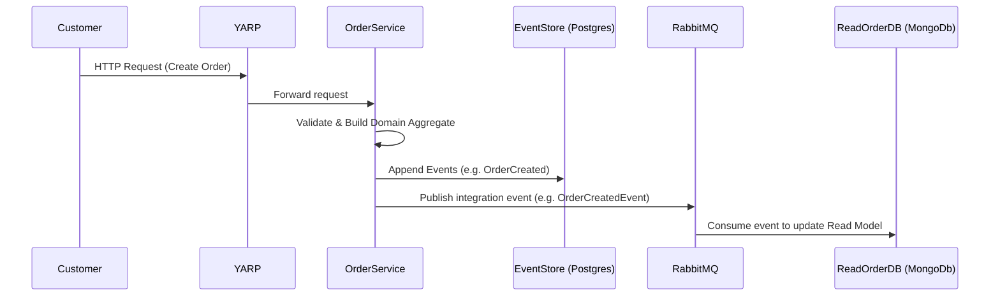

# Rookie-MechkeyShop - Phase 1

## Link Weekly Report
-   Week 1: https://drive.google.com/drive/folders/10Xur1ME2guIPuDCG-lwsXr4_gEkThzpd?usp=sharing
-   Week 2: https://drive.google.com/file/d/1KgVIuf9x-N1KSwedu2jqpmB2Z-kp6yLd/view?usp=drive_link
-   Week 3: https://drive.google.com/file/d/1_XW82XyHNXeg1QbVN2FXHRxNaxT4m8sA/view

## System Architecture

  

## Architecture Highlights ⚙️
- **Microservices**:
  - **Catalog Service**: Handles CRUD category, product, product-image

  - **Order Service**: Handles order creation, payment flow, and order state management. Uses Event Sourcing to store immutable domain events for full auditability and replay.

  - **Notification Service**: Listens to events like OrderCreated, UserRegistered, etc., and sends emails asynchronously. Stores email logs in MongoDB.

- **Messaging**:
Asynchronous event dispatch via RabbitMQ using MassTransit, decoupling services and improving scalability.

- **Caching**:
Utilizes Redis to cache frequently queried data (e.g., product listings, categories).

- **Reverse Proxy**:
Admin portal routes requests through YARP, which handles rate limiting, load balancing, and service discovery.

- **Cloud Storage**:
Product images are uploaded and stored in Supabase Storage Buckets.

- **Observability**:
Integrated .NET Aspire for distributed tracing, metrics, and health checks across microservices.

## Order Service – Event Sourcing Implementation 🧩
### Structure
- CQRS pattern with MediatR
- EventStore: PostgreSQL
- ReadDb: MongoDB
### 🔁 Event Flow in Order Service

## Technologies Used 🧰
| Technology                                                                        | Description                                  |
| --------------------------------------------------------------------------------- | -------------------------------------------- |
| [.NET 8](https://learn.microsoft.com/en-us/dotnet/)                               | Backend development framework                |
| [.NET Aspire](https://learn.microsoft.com/en-us/dotnet/aspire/)                   | Observability and diagnostics                |
| [ASP.NET Core MVC](https://learn.microsoft.com/en-us/aspnet/core/mvc/)            | Admin & API web framework                    |
| [React.js](https://reactjs.org/docs/getting-started.html)                         | Customer-facing frontend                     |
| [Entity Framework Core](https://learn.microsoft.com/en-us/ef/core/)               | ORM for relational data                      |
| [SQL Server](https://learn.microsoft.com/en-us/sql/sql-server/)                   | Primary relational database                  |
| [Redis](https://redis.io/docs/)                                                   | In-memory cache for fast access              |
| [RabbitMQ](https://www.rabbitmq.com/documentation.html)                           | Message broker for async communication       |
| [MassTransit](https://masstransit.io/documentation/)                              | Abstraction layer for messaging              |
| [Supabase](https://supabase.com/docs)                                             | Cloud storage for images                     |
| [YARP](https://learn.microsoft.com/en-us/aspnet/core/fundamentals/reverse-proxy)  | Reverse proxy and routing                    |
| [Clean Architecture](https://jasontaylor.dev/clean-architecture-getting-started/) | Project structure and separation of concerns |

